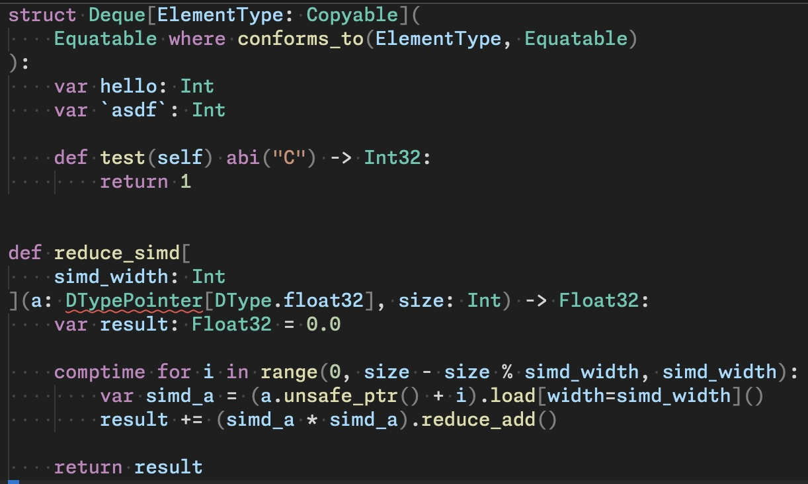
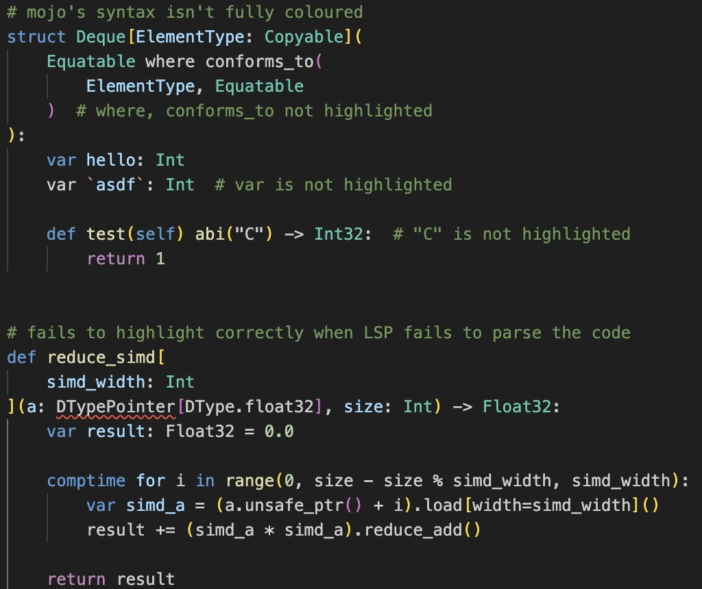

# zed-mojo

A Zed extension for the Mojo programming language.

## Features

- **v1.0.0b1 syntax support** - full grammar coverage from `comptime` to ownership keywords and more, powered by [`tree-sitter-mojo`](https://github.com/whistlebee/tree-sitter-mojo)
- **Debugger support** - launch, set breakpoints, step through via `mojo-lldb` adapter
- **Proper indents & folding** - code folds smartly, indent guides follow the language structure
- **Language server integration** - diagnostics, go-to-definition, hover, completions via `mojo-lsp-server`

Often provides better syntax highlighting than the official VSCode Mojo extension.

| Zed Mojo | VSCode Mojo |
| :---: | :---: |
|  |  |

## Installation

This extension is not yet published in the Zed extension store. To install it manually:

Clone this repository, then open Zed, open the command palette, select `zed: install dev extension`, and pick the folder containing this code.

## Language Server

The extension looks for `mojo-lsp-server` in `PATH` and in the project's `.pixi` directory. If the server is not found, an error message will prompt you to install Mojo.

## Configuration

You can configure the Mojo SDK path in your Zed `settings.json`. This is useful when the Mojo SDK is not on your `PATH`, or you want to use a specific SDK installation.

### Setting a custom SDK path

Add the following to your `settings.json` (or project-level `.zed/settings.json`):

```json
{
  "lsp": {
    "mojo-lsp-server": {
      "settings": {
        "mojo_sdk_path": "/path/to/mojo/sdk"
      }
    }
  }
}
```

When `mojo_sdk_path` is set, all Mojo binaries (`mojo-lsp-server`, `mojo-lldb-dap`, `mojo`, etc.) are resolved relative to this path. If it is not set, the extension falls back to searching your `PATH`.

### Overriding just the LSP binary

If you only need to override the language server binary path:

```json
{
  "lsp": {
    "mojo-lsp-server": {
      "binary": {
        "path": "/custom/path/to/mojo-lsp-server"
      }
    }
  }
}
```

## Debugging

To configure debugging for a Mojo project, create a `.zed/debug.json` file in the project root with the following contents:

```json
[
  {
    "label": "Mojo: Debug basic example",
    "adapter": "mojo-lldb",
    "request": "launch",
    "cwd": "$ZED_WORKTREE_ROOT",
    "mojoFile": "$ZED_WORKTREE_ROOT/examples/debug_basic.mojo",
    "args": []
  }
]
```

Open `examples/debug_basic.mojo`, run `debugger: start` in Zed, and select the "Mojo: Debug basic example" configuration. Set breakpoints and step through your code. Adjust the filename and arguments for your own project.
