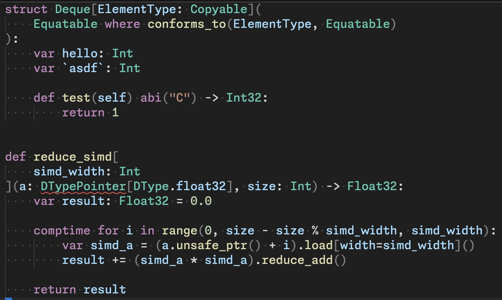
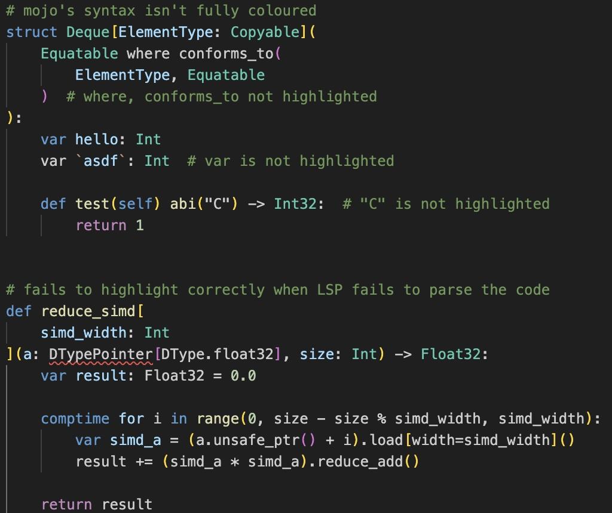

# zed-mojo

A Zed extension for the Mojo programming language.

Licensed under the [MIT License](LICENSE).

## Features

- **Mojo 1.1 support** - powered by [`tree-sitter-mojo`](https://github.com/whistlebee/tree-sitter-mojo)
- **Debugger support** - launch, set breakpoints, step through via `mojo-lldb` adapter
- **Proper indents & folding** - code folds smartly, indent guides follow the language structure
- **Language server integration** - diagnostics, go-to-definition, hover, completions via `mojo-lsp-server`

Often provides better syntax highlighting than the official VSCode Mojo extension.

| Zed Mojo | VSCode Mojo |
| :---: | :---: |
|  |  |

## Installation

This extension is not yet published in the Zed extension store. To install it manually:

Clone this repository, then open Zed, open the command palette, select `zed: install dev extension`, and pick the folder containing this code.

## Language Server

The extension looks for `mojo-lsp-server` in `PATH` and in the project's `.pixi` directory. If the server is not found, an error message will prompt you to install Mojo.

## Configuration

Open the project directory as a Zed workspace for project-level LSP settings to apply. A file-only workspace falls back to the server found on `PATH`.

You can configure the Mojo SDK path in your Zed `settings.json`. This is useful when the Mojo SDK is not on your `PATH`, or you want to use a specific SDK installation.

### Setting a custom SDK path

Add the following to your `settings.json` (or project-level `.zed/settings.json`):

```json
{
  "lsp": {
    "mojo-lsp-server": {
      "settings": {
        "mojo_sdk_path": "/path/to/mojo/sdk"
      }
    }
  }
}
```

When `mojo_sdk_path` is set, all Mojo binaries (`mojo-lsp-server`, `mojo-lldb-dap`, `mojo`, etc.) are resolved relative to this path. If it is not set, the extension falls back to searching your `PATH`.

### Overriding just the LSP binary

If you only need to override the language server binary path:

```json
{
  "lsp": {
    "mojo-lsp-server": {
      "binary": {
        "path": "/custom/path/to/mojo-lsp-server"
      }
    }
  }
}
```

The extension forwards `binary.arguments` and `binary.env` as well, so a
project can pass Mojo module roots with repeated `-I` arguments.

For a Bazel Mojo toolchain, put the compiled SDK modules and any source
checkout needed for navigation in the arguments. Put the source root before
the compiled package when you want Go To Definition to open MAX sources:

```json
{
  "lsp": {
    "mojo-lsp-server": {
      "binary": {
        "path": "bazel-main/external/rules_mojo++mojo+mojo_toolchain_macos_arm64/bin/mojo-lsp-server",
        "arguments": [
          "-I", "/path/to/max/kernels/src",
          "-I", "/path/to/mojo-sdk/lib/mojo",
          "-I", "/path/to/project/src"
        ]
      }
    }
  }
}
```

When a binary path is configured, the extension uses that binary's `bin`
directory and does not export an inherited Pixi or Conda SDK environment over
it. This keeps a global `pixi global install mojo` shim from changing which
runtime the Bazel language server loads.

## Formatting

With a saved Mojo file open, run `task: spawn` and select
**Mojo: Format current file**. The task saves the current buffer, runs
`mojo format` on that file, and hides the terminal on success. Errors remain
visible in the task terminal. Reload/rebuild the dev extension after updating
it to load the new task.

The task uses `mojo` from your shell's `PATH`. To use a custom SDK, add an
explicit override to your project's `.zed/tasks.json`:

```json
[
  {
    "label": "Mojo: Format current file",
    "command": "\"/path/to/mojo/sdk/bin/mojo\" format \"$ZED_FILE\"",
    "cwd": "$ZED_WORKTREE_ROOT",
    "save": "current",
    "allow_concurrent_runs": false,
    "reveal": "no_focus",
    "hide": "on_success"
  }
]
```

You can use `$ZED_WORKTREE_ROOT` for a project-relative SDK path. For Pixi,
use `pixi run mojo format "$ZED_FILE"` as the command. Task commands are
configured separately from the LSP's `mojo_sdk_path` and binary settings.

The Mojo installation must include its formatter; compiler-only Bazel
toolchains can report `unable to resolve Mojo formatter in PATH`.

To bind the task to a shortcut, add an entry to your Zed `keymap.json`:

```json
[
  {
    "context": "Editor && language == Mojo",
    "bindings": {
      "alt-shift-f": [
        "task::Spawn",
        { "task_name": "Mojo: Format current file" }
      ]
    }
  }
]
```

## Organizing imports

Install the native `moff` binary on your shell's `PATH`, then run **Mojo:
Organize imports** from Zed's task picker. The task saves the current buffer
and runs `moff check --fix "$ZED_FILE"`. It works without a background worker.
Its terminal remains visible on failure. Import organization and `mojo format`
are separate tasks; neither runs automatically on save.

Override the task in your project's `.zed/tasks.json` to set source roots or
package classifications:

```json
[
  {
    "label": "Mojo: Organize imports",
    "command": "moff check --fix --src src --known-first-party metallic_max --known-third-party max \"$ZED_FILE\"",
    "cwd": "$ZED_WORKTREE_ROOT",
    "save": "current",
    "allow_concurrent_runs": false,
    "reveal": "no_focus",
    "hide": "on_success"
  }
]
```

For a `moff` build that supports `serve` and `request`, start **Mojo: Start
import worker** once per workspace, then use **Mojo: Organize imports (worker)**.
This keeps the runtime loaded and sends paths through `.zed/moff.in` and
`.zed/moff.out`. Pass source roots and package classifications on the worker's
`serve` command. Check `moff --help` before using these optional worker tasks;
older installations support only `check`.

After updating the extension, rebuild/reload the dev extension and select the
task afresh with `task: spawn`. Rerunning an old terminal task can reuse its old
command. If the output shows only `/bin/zsh -i -c 'moff'`, the task being run
is missing its arguments; the default task should show `moff check --fix`
followed by the current file's path. Check project/global task overrides too.

## Debugging

To configure debugging for a Mojo project, create a `.zed/debug.json` file in the project root with the following contents:

```json
[
  {
    "label": "Mojo: Debug basic example",
    "adapter": "mojo-lldb",
    "request": "launch",
    "cwd": "$ZED_WORKTREE_ROOT",
    "mojoFile": "$ZED_WORKTREE_ROOT/examples/debug_basic.mojo",
    "args": []
  }
]
```

Open `examples/debug_basic.mojo`, run `debugger: start` in Zed, and select the "Mojo: Debug basic example" configuration. Set breakpoints and step through your code. Adjust the filename and arguments for your own project.
